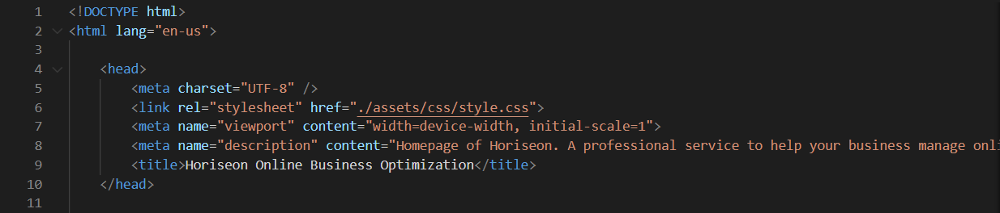
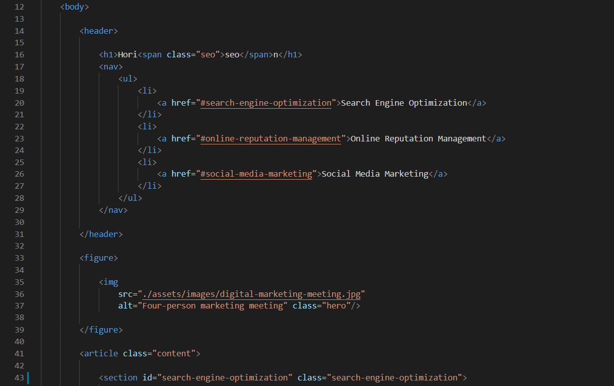
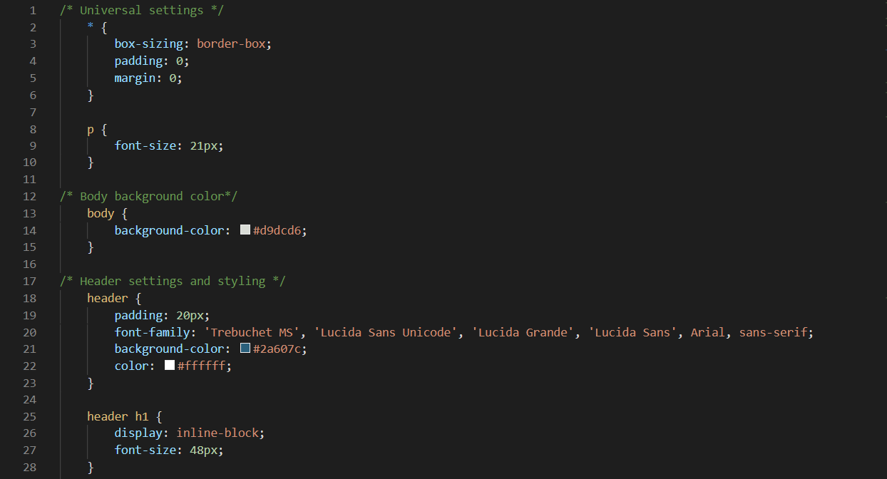

# Horiseon-code-refactor

This project aims to improve the accessibility of a given site by Horiseon by refactoring the html and css code. Features of code refactoring in this project includes adding semantic html elements, reorganizing stylistic functions in css, and adding concise title to the site and alt texts to all images as requested. Additional features include adding a meta description, and increased font size. Adding semantic html elements and css function reorganizing enables the code to be more legible to other developers, allowing them to quickly identify the function of each section of the code and locate specific elements. Adding alt texts to images and increasing font size allows makes the site more accessible to viewers with visual disabilities or slow internet. Having a concise title and meta description improves priority of appearance on search engines.
​
## Getting Started
​
To open the deployed site, click [here](https://tonyzyt9947.github.io/Horiseon-code-refactor/).

To view the html code, open index.html.

To view the css code, open assets/css/style.css.
​
 

### Prerequisites
​
The site should be able to run on any web browser.
 
### Installing

Click [here](https://www.google.com/chrome/) to install google chrome to open the site.

 

## Built With

* [HTML](https://developer.mozilla.org/en-US/docs/Web/HTML)
* [CSS](https://developer.mozilla.org/en-US/docs/Web/CSS)
  
## Deployed Link

* [See Live Site](https://tonyzyt9947.github.io/Horiseon-code-refactor/)
​
​  
## Feature Implementation Code Examples

1. Added meta-description (line 8) and title (line 9)

2. Added semantic elements (header:line 14, 31; figure:line 33,39; article:line 41) and alt texts for images (line 37).

3. Increased font size (line 9), labeled functions of css code (line 1, 12) and organized css functions into related sections (line 17).

## Authors

* **Tony Zhang** 
- [Link to Portfolio Site] (under construction)
- [Link to Github](https://github.com/Tonyzyt9947)
- [Link to LinkedIn](https://www.linkedin.com/in/tony-zhang-61670421b/)
​
  

## License
​
This project is licensed under the MIT License 
​
  
## Acknowledgments
* Inspiration: Lecture by Manuel Matuzovic, _"Writing CSS with Accessibility in Mind"_ 2017. [Link](https://www.youtube.com/watch?v=EOiC2M47GBY&t=503s)
* Lighthouse chrome extension. [Link](https://developers.google.com/web/tools/lighthouse)